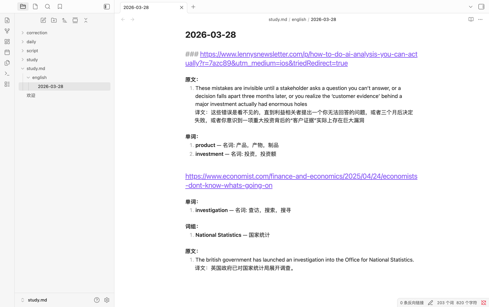
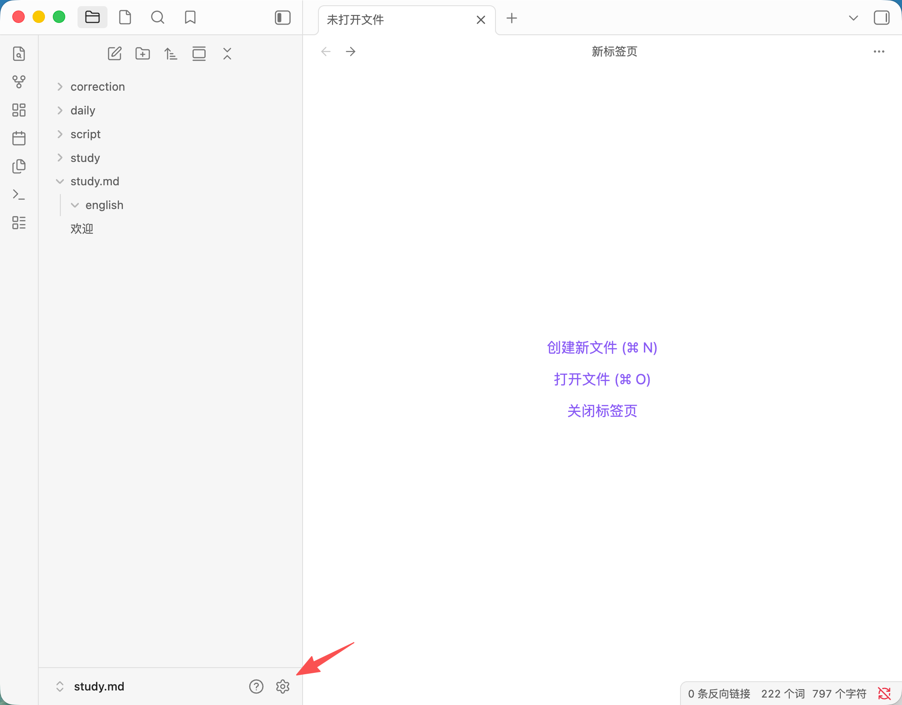
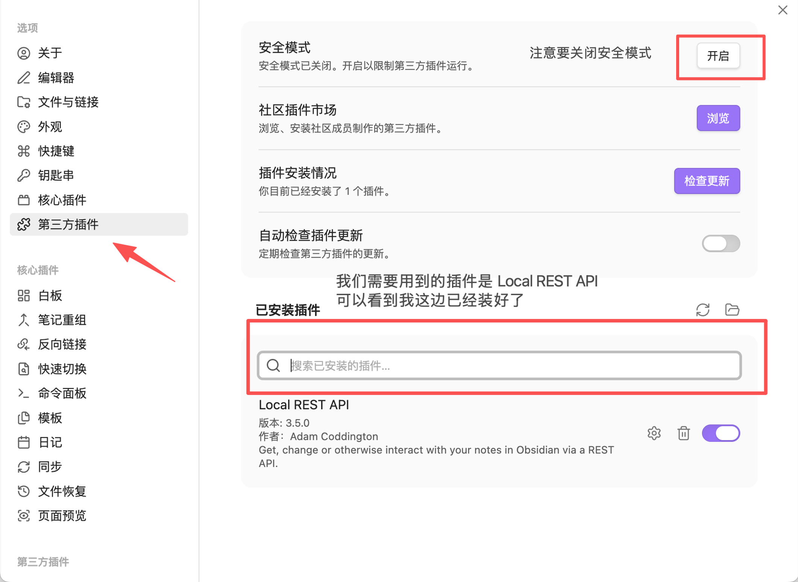
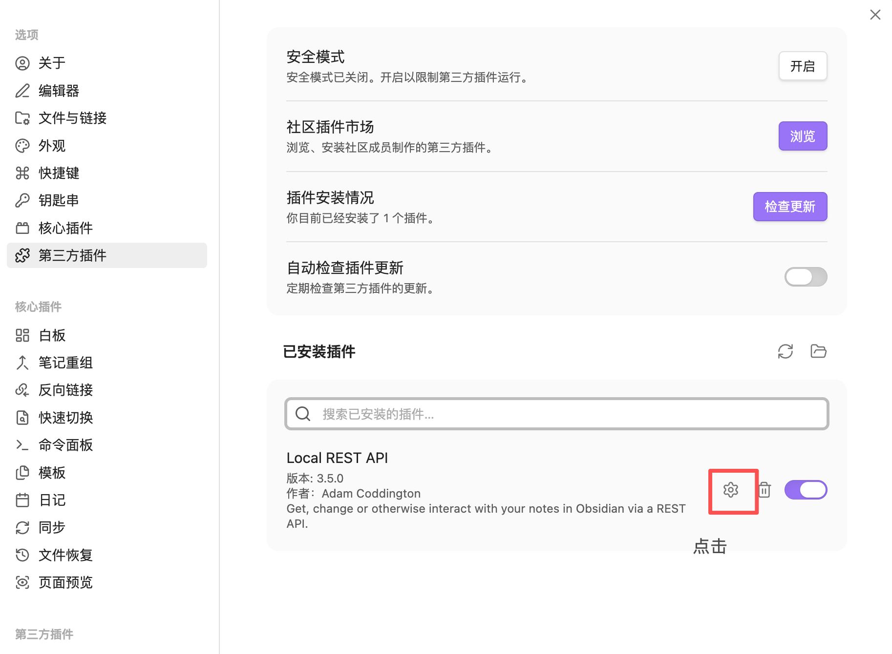
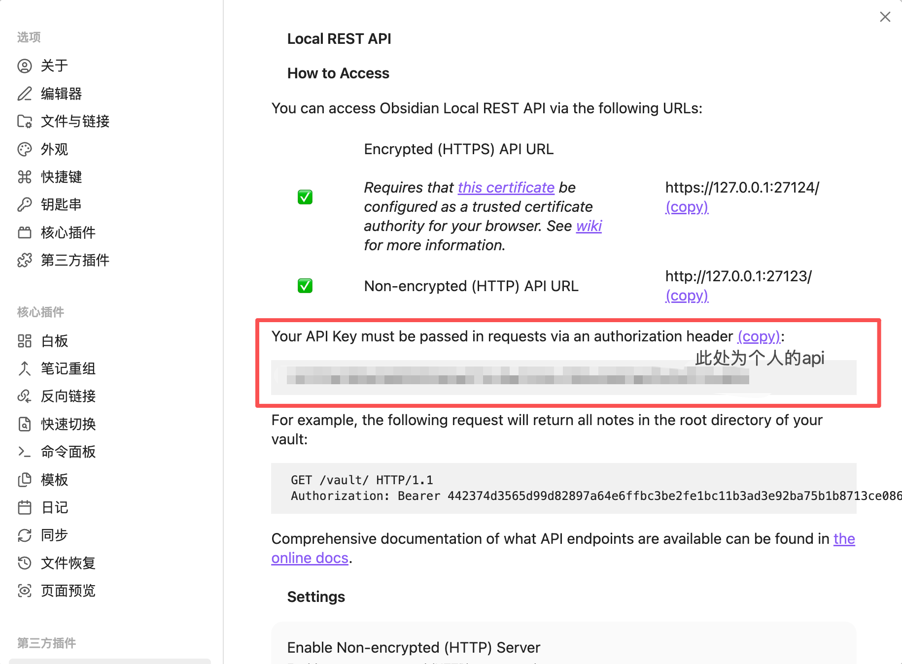

# TransVault

**划词翻译，自动归档到 Obsidian。**

在 AI 时代，阅读大量英文文献变得越来越必要。无论你是 AI 开发者、研究者，还是有外语阅读需求的学习者，在浏览外文网页时总会遇到生词、短语或长句需要翻译。但翻完就忘，手动抄录又太麻烦。

TransVault 用于解决：划选即翻译，一键存入 Obsidian，自动按日期、来源网页、内容类型归档整理。

> 把碎片化的翻译，变成系统化的知识积累。

---

## 效果预览



---

## 功能特性

- **划词即翻译** — 在任意网页上选中文字，自动弹出翻译浮窗
- **智能分类** — 自动识别单词、词组、句子，分别归类保存
- **单词词性标注** — 单词自动标注 名词 / 动词 / 形容词 等词性及释义
- **按日期归档** — 每天生成独立文件（如 `2026-03-28.md`），互不干扰
- **按来源网页分组** — 同一网页的翻译归在一起，切换网页自动分段
- **回溯合并** — 回到之前的网页继续翻译，内容自动合并到对应分组
- **一键保存** — 翻译后手动点击保存，避免误存

---

## 保存格式示例

文件名：`2026-03-28.md`

```markdown
### https://www.economist.com/some-article

**单词：**
1. **available** — 形容词: 可得到，合宜的，可用的
2. **infrastructure** — 名词: 基础设施，基础建设

**词组：**
1. **take over** — 接管，接收
2. **look forward to** — 期待，盼望

**原文：**
1. They are not available for registration or transfer.
   译文：它们不可用于注册或转让。

### https://en.wikipedia.org/some-page

**单词：**
1. **hypothesis** — 名词: 假设，假说
```

---

## 工作原理

```
网页划选文字
    ↓
油猴脚本检测选中内容
    ↓
调用 Google Translate API 翻译
    ↓
弹窗显示原文 + 译文（单词附带词性）
    ↓
点击「保存到 Obsidian」
    ↓
通过 Obsidian Local REST API 写入笔记
    ↓
自动按 日期/来源URL/内容类型 归档
```

### 内容类型判断逻辑

| 类型 | 判断规则 | 保存格式 |
|------|---------|---------|
| 单词 | 仅 1 个词，无标点 | 词性 + 释义 |
| 词组 | 2-5 个词，无句末标点 | 原文 + 翻译 |
| 句子 | 其他情况 | 原文 + 译文对照 |

---

## 安装步骤

### 1. 安装 Tampermonkey

在浏览器扩展商店搜索 **Tampermonkey**（篡改猴）并安装：
- [Chrome](https://chromewebstore.google.com/detail/tampermonkey/dhdgffkkebhmkfjojejmpbldmpobfkfo)
- [Firefox](https://addons.mozilla.org/firefox/addon/tampermonkey/)
- [Edge](https://microsoftedge.microsoft.com/addons/detail/tampermonkey/iikmkjmpaadaobahmlepeloendndfphd)

> 安装后进入扩展详情页，确保 **「允许运行用户脚本」** 已开启（Chrome 用户在 `chrome://extensions` → Tampermonkey 详情页中开启）。

### 2. 安装 Obsidian Local REST API 插件

1. 打开 Obsidian → **设置**（左下角齿轮）→ **第三方插件** → 关闭安全模式



2. 点击 **浏览** → 搜索 **Local REST API** → 安装并启用



3. 进入插件设置，点击 Local REST API 旁边的齿轮图标



4. 开启 **Enable Non-encrypted (HTTP) Server**，记下你的 **API Key**（后面要用）



### 3. 在 Obsidian 中创建保存文件夹

在你的 Vault 中创建翻译记录的存放路径，例如：

```
你的Vault/
  study.md/
    english/      ← 翻译记录会按日期自动生成文件保存在这里
```

你可以根据自己的需要自定义路径和文件夹名称，后面在脚本配置中对应修改即可。

### 4. 安装 TransVault 脚本

**方式一：直接安装（推荐）**

点击下方链接，Tampermonkey 会自动弹出安装提示：

👉 [安装 TransVault](../../raw/main/translate-to-obsidian.user.js)

**方式二：手动安装**

1. 打开 Tampermonkey → 点击 **添加新脚本**
2. 删掉编辑器里的默认内容
3. 打开本项目的 [`translate-to-obsidian.user.js`](./translate-to-obsidian.user.js) 文件，复制全部内容
4. 粘贴到 Tampermonkey 编辑器中
5. 按 `Ctrl + S`（Mac 按 `Cmd + S`）保存

### 5. 配置脚本

在 Tampermonkey 中打开脚本编辑器，找到顶部的 `CONFIG` 配置区域（第 16-33 行）。

**必须填写：**

| 行数 | 配置项 | 说明 |
|------|--------|------|
| **第 19 行** | `OBSIDIAN_API_KEY` | 填入第 2 步中记下的 API Key |
| **第 23 行** | `NOTE_FOLDER` | 改成第 3 步中创建的文件夹路径 |

**可选修改（有默认值，不改也能用）：**

| 行数 | 配置项 | 默认值 | 说明 |
|------|--------|--------|------|
| 第 21 行 | `OBSIDIAN_API_URL` | `http://127.0.0.1:27123` | API 地址，一般不用改 |
| 第 27 行 | `SOURCE_LANG` | `auto` | 源语言，auto 为自动检测 |
| 第 29 行 | `TARGET_LANG` | `zh` | 目标语言，默认翻译为中文 |
| 第 31 行 | `MIN_LENGTH` | `2` | 最少选中几个字符才触发 |
| 第 33 行 | `MAX_LENGTH` | `500` | 最多选中几个字符以内才触发 |

配置示例：

```javascript
const CONFIG = {
  OBSIDIAN_API_KEY: '在这里填你的API_KEY',  // ← 必填
  OBSIDIAN_API_URL: 'http://127.0.0.1:27123',
  NOTE_FOLDER: 'study.md/english',           // ← 必填，改成你的文件夹路径
  TRANSLATE_API_URL: 'https://translate.googleapis.com/translate_a/single',
  SOURCE_LANG: 'auto',
  TARGET_LANG: 'zh',
  MIN_LENGTH: 2,
  MAX_LENGTH: 500,
};
```

> **最简配置：只需要填第 19 行的 API Key 就能用，其他都有默认值。**

保存后刷新网页即可生效。

---

## 使用方法

### 翻译并保存

1. 打开任意外文网页
2. **划选**你想翻译的单词、词组或句子
3. 自动弹出翻译浮窗，显示原文和译文
4. 点击 **「保存到 Obsidian」** 按钮
5. 翻译内容会自动保存到 Obsidian 笔记中


### 查看翻译记录

打开 Obsidian，进入你设置的文件夹路径，会看到按日期生成的文件：

```
study.md/english/
  2026-03-28.md
  2026-03-29.md
  ...
```

每个文件按来源网页分组，内容按单词、词组、原文分类整理，方便复习。

### 小提示

- **不会自动保存** — 翻译后需要手动点击保存按钮，避免误存不需要的内容
- **Obsidian 必须保持打开** — 脚本通过本地 API 与 Obsidian 通信，关闭 Obsidian 后无法保存
- **点击弹窗外的区域**可以关掉翻译弹窗

---

## 多语言支持

TransVault 不限于英语翻译。修改 `TARGET_LANG` 和 `SOURCE_LANG` 即可支持任意语言组合：

| 场景 | SOURCE_LANG | TARGET_LANG |
|------|------------|------------|
| 英文 → 中文 | `auto` | `zh` |
| 日文 → 中文 | `ja` | `zh` |
| 韩文 → 中文 | `ko` | `zh` |
| 中文 → 英文 | `zh` | `en` |
| 法文 → 英文 | `fr` | `en` |

完整语言代码参考 [Google Translate 语言列表](https://cloud.google.com/translate/docs/languages)。

---

## 项目结构

```
TransVault/
├── translate-to-obsidian.user.js   # 油猴脚本（核心代码）
├── README.md                        # 项目说明
└── screenshot/                      # 截图文件夹
    ├── xiaoguo.png                  # Obsidian 笔记效果截图
    ├── api_1.png                    # 安装教程截图 - 打开设置
    ├── api_2.png                    # 安装教程截图 - 安装插件
    ├── api_3.png                    # 安装教程截图 - 进入插件设置
    └── api_4.png                    # 安装教程截图 - 获取 API Key
```

---

## 技术栈

- **Tampermonkey** — 浏览器用户脚本管理器
- **Google Translate API** — 免费翻译接口（含词性数据）
- **Obsidian Local REST API** — 本地 REST 接口，将内容写入 Obsidian 笔记

---

## 常见问题

**Q: 翻译弹窗不出现？**
- 确认 Tampermonkey 已启用，且脚本开关打开
- 在扩展详情页确认「允许运行用户脚本」已开启
- 刷新页面后重试

**Q: 翻译成功但保存失败？**
- 确认 Obsidian 已打开，Local REST API 插件已启用
- 确认已开启 HTTP Server（非 HTTPS）
- 确认 API Key 填写正确

**Q: 支持哪些浏览器？**
- Chrome、Edge、Firefox、Safari（需安装 Tampermonkey 或 Greasemonkey）

---

## 开发背景

在 AI 时代下，阅读大量外语文献变得越来越必要。特别是对于 AI 开发者和研究者来说，英文长文是日常。

市面上的翻译工具（如豆包、Google 翻译插件）虽然好用，但翻完就没了——不能自动保存、不能归档复习。手动抄到笔记里又太打断阅读流程。

TransVault 的初衷就是：**在不打断阅读的前提下，把每一次翻译都变成可复习的知识记录。**

---

## License

MIT
